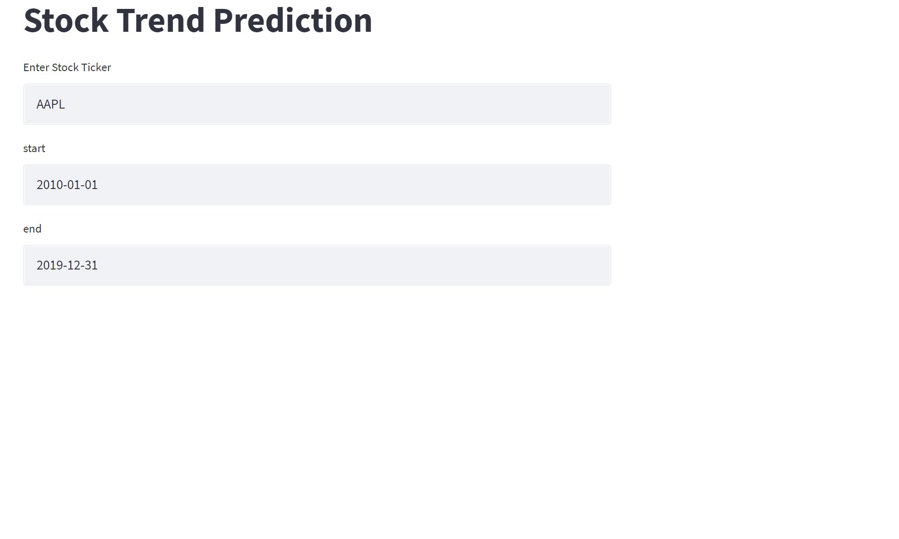
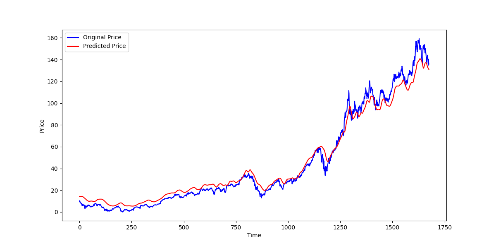

# Stock-Price-Prediction
Machine learning based stock price prediction system.

we use Long Short term memory algoritham for developing model for stock price prediction.

we also make 100 days average , 200 days average upto 400 days average charts. 

How It Works (website):-

1.User Should enter stockticker, startdate , enddate

stock ticker is unique name of stock. Ex:- TCS,AAPL(apple inc.)

Output :- 

